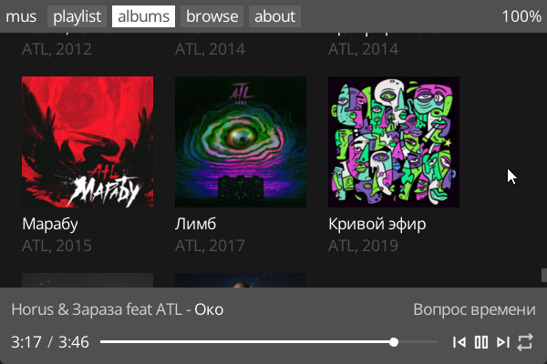

<p align=center>

</p>
<h1 align=center>mus2</h1>

Simple and fast music player. Rewrite of [mus](https://github.com/thisisignitedoreo/mus).

Features:
- MP3 and FLAC tag support.
- Album scanning in directory trees.
- Simple browse tab and a search box.

## Quickstart
Download a binary from releases, or build from source:
```console
$ python bundle.py
...
$ ./build.sh
```

## Gallery




## Thanks to
- @raysan5 for the amazing raylib library
- @googlefonts for a font for this app (OpenSans)
- @google for all the icons for this app
- @morhertz and @rexim for color schemes that were adapted

